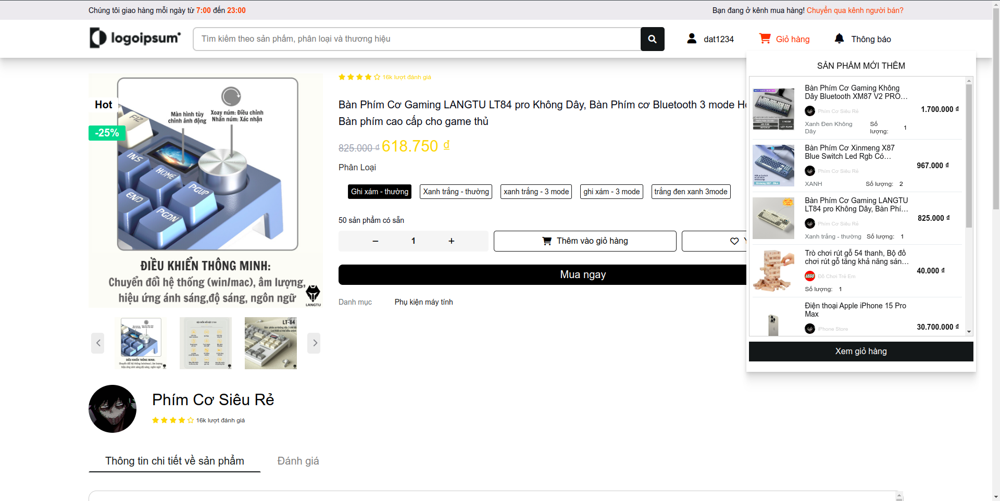

# PBL3 - Ứng dụng Thương Mại Điện Tử

## Giới thiệu
Đây là một dự án phát triển ứng dụng thương mại điện tử tương tự như Shopee, cho phép người dùng có thể mua sắm trực tuyến và người bán có thể đăng bán sản phẩm. Ứng dụng bao gồm ba loại người dùng chính: người mua, người bán và quản trị viên (admin). Các chức năng đa dạng được xây dựng để đáp ứng nhu cầu sử dụng của từng loại người dùng.

## Thành viên nhóm
- **Hoàng Văn Đạt**
- **Trương Vũ Linh**
- **Đỗ Văn Tuấn**
- **Ngô Công Hạnh**

## Các công nghệ sử dụng
- Java Servlet, JSP
- HTML, CSS, JavaScript
- MySQL
- Tomcat Server

## Figma
https://www.figma.com/file/jHeesxgafC1ZvgipPIgKbK/PBL-3---S%C3%A0n-Th%C6%B0%C6%A1ng-M%E1%BA%A1i-%C4%90i%E1%BB%87n-T%E1%BB%AD---UX%2FUI-Deign?type=design&node-id=0%3A1&mode=design&t=IRtBsE3fU73fROy5-1

## Hướng dẫn cài đặt
1. Clone dự án:
   ```bash
   git clone https://github.com/hoangdat6/pb3_beebee.git
## Các chức năng chính

### 1. Chức năng người mua
- **Trang chủ**: Hiển thị các sản phẩm nổi bật, danh mục sản phẩm, và tìm kiếm sản phẩm.

  <p align="center">
    
    
    
  </p>
- **Sản phẩm**: Xem chi tiết sản phẩm, thông tin giá cả, mô tả sản phẩm.
  <p align="center">
    
    
    
  </p>
- **Giỏ hàng**: Thêm, xóa, chỉnh sửa số lượng sản phẩm trong giỏ hàng.
  <p align="center">
    
    
    
  </p>
- **Thanh toán**: Chọn phương thức thanh toán, hiển thị tổng chi phí.
  <p align="center">
    
    
    
    
  
  </p>
- **Thanh toán bằng QR**: Cho phép quét mã QR để thanh toán nhanh chóng.
  <p align="center">
    
  </p>

### 2. Chức năng người bán
- **Quản lý sản phẩm**: Xem, thêm, sửa, xóa sản phẩm.
  <p align="center">
    
  </p>
- **Thêm sản phẩm**: Thêm mới sản phẩm với các thông tin chi tiết như mô tả, giá bán, hình ảnh.
  <p align="center">
    
    
    
  </p>
- **Phân tích bán hàng**: Xem báo cáo bán hàng, thống kê sản phẩm bán chạy, tổng doanh thu.
   <p align="center">
    
  </p>

### 3. Chức năng quản trị viên (Admin)
- **Quản lý người bán**: Phê duyệt tài khoản người bán, theo dõi thông tin người bán.
   <p align="center">
    
    
    
  </p>
- **Thống kê**: Xem báo cáo thống kê số lượng người bán, doanh thu hệ thống.
  <p align="center">
    
  </p>


